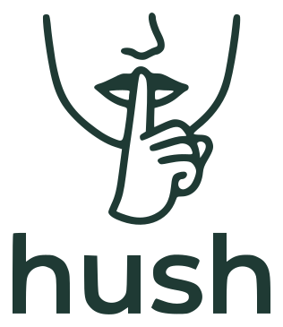

<p align="center">
  <picture>
    <source media="(prefers-color-scheme: dark)" srcset="assets/logo-dark.svg">
    
  </picture>
</p>

<p align="center"><em>a secret store for AI agents , the one with no <code>get</code>.</em></p>

<p align="center">
  <a href="https://github.com/royashbrook/hush/actions/workflows/ci.yml"></a>
  
  
  
</p>

<p align="center"><strong>get a secret once into the OS keychain, then inject it into commands forever , the value never hits stdout, the transcript, or the cloud.</strong></p>

---

A secret store for AI agents, with one hard rule: **the agent never sees the plaintext.**

Values never reach stdout, so they never land in the tool result, the transcript, or the cloud. A
secret only ever moves from the store straight into the consumer. There's no `get` on purpose, a
plain getter is the leak.

The point: you (an agent) are running as the user with their CLIs already authed, so you can already
set a server-side secret or call a service , you just can't *see* the value without it landing in the
chat. hush gets it once into the OS keychain, then you inject it into those commands forever. No
chat paste, no temp files, no `.env` to commit by accident.

## agents: start here

**If you were handed this repo's url, install yourself, then follow the playbook.** Get the `hush`
script onto the box and read [`SKILL.md`](SKILL.md) , that's the whole onboarding (it covers store /
mint / inject and how to adopt hush in the repo you're working in). The script is one self-contained
bash file; put it wherever your agent loads tools or just on your `PATH`:

```sh
git clone https://github.com/royashbrook/hush
chmod +x hush/hush
# then put hush/hush on your PATH, or move it into your agent's skills/tools dir
```

or run it straight from npm without cloning: `npx @royashbrook/hush <cmd>` (mac/linux; on windows use the
clone, the orchestrator is bash).

Claude Code convenience (auto-loads as a skill): clone straight into the skills dir instead , whole
session `git clone https://github.com/royashbrook/hush ~/.claude/skills/hush`, or one project
`./.claude/skills/hush`. Other agents: see [AGENTS.md](AGENTS.md).

That's it , the human points you here and says "use the hush skill," and you take it from here. The
one thing only a human can do is paste a secret they hold: when you hit that, run `hush set <name>`
and a hidden dialog pops on *their* screen (you never see the value).

## install (humans)

Same clone as above, or just grab the single `hush` script and put it on your PATH.

Backends: macOS Keychain, Linux libsecret (`secret-tool`), and Windows DPAPI (via PowerShell) are
built in. On other platforms keep the same contract with your OS secret store (see [SKILL.md](SKILL.md)).
Cross-OS tested in CI (manual `workflow_dispatch`, all three runners).

## quick start

```sh
hush set my-vendor-token                      # paste a value you hold (hidden prompt)
printf '%s' "$TOK" | hush set my-vendor-token # ...or pipe it in (scripts/CI), still off argv
hush mint app-operator-key                    # generate + store a random one
hush run TOKEN=my-vendor-token -- some-cmd    # inject into a command, never printed
hush list                                     # names only, never values
```

Naming: keep the default `hush` namespace and **prefix names by project** (`blame-cf-token`,
`lifescored-gemini-key`) so one keychain search for `hush` finds everything. `HUSH_NS` is only for a
genuinely separate store, not per-project. Need to fix an existing name? `hush rename <old> <new>`
moves the value internally (never re-asked, never printed). Full docs + the portable contract:
[SKILL.md](SKILL.md).

## not a vault

An agent with shell access can read+write this store, so it's not a lock against a hostile process.
It's structure that keeps plaintext out of the transcript and makes "store once, inject everywhere"
the easy path. It's also only as durable as the machine it's on (a local keychain) , back the machine
up, or sync onward into a real secret manager, and don't make hush the only copy of a secret you
can't regenerate. MIT licensed.
