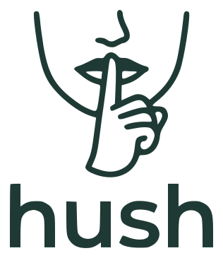

<p align="center">
  <picture>
    <source media="(prefers-color-scheme: dark)" srcset="assets/logo-dark.svg">
    
  </picture>
</p>

<p align="center"><em>a secret store for AI agents, the one with no <code>get</code>.</em></p>

<p align="center">
  <a href="https://github.com/royashbrook/hush/actions/workflows/ci.yml"></a>
  
  
  
</p>

<p align="center"><strong>get a secret once into the OS keychain, then inject it into commands forever, the value never hits stdout, the transcript, or the cloud.</strong></p>

---

A secret store for AI agents, with one hard rule: **the agent never sees the plaintext.**

Values never reach stdout, so they never land in the tool result, the transcript, or the cloud. A
secret only ever moves from the store straight into the consumer. There's no `get` on purpose, a
plain getter is the leak.

The point: you (an agent) are running as the user with their CLIs already authed, so you can already
set a server-side secret or call a service, you just can't *see* the value without it landing in the
chat. hush gets it once into the OS keychain, then you inject it into those commands forever. No
chat paste, no temp files, no `.env` to commit by accident.

## agents: start here

**If you were handed this repo's url, install yourself, then follow the playbook.** Get the `hush`
script onto the box and read [`SKILL.md`](SKILL.md), that's the whole onboarding (it covers store /
mint / inject and how to adopt hush in the repo you're working in). The script is one self-contained
bash file; put it wherever your agent loads tools or just on your `PATH`:

```sh
git clone https://github.com/royashbrook/hush
chmod +x hush/hush
# then put hush/hush on your PATH, or move it into your agent's skills/tools dir
```

or run it straight from npm without cloning: `npx @royashbrook/hush <cmd>` (mac/linux; on windows use the
clone, the orchestrator is bash).

Claude Code convenience (auto-loads as a skill): clone straight into the skills dir instead, whole
session `git clone https://github.com/royashbrook/hush ~/.claude/skills/hush`, or one project
`./.claude/skills/hush`. Other agents: see [AGENTS.md](AGENTS.md).

That's it, the human points you here and says "use the hush skill," and you take it from here. The
one thing only a human can do is paste a secret they hold: when you hit that, run `hush set <name>`
and a hidden dialog pops on *their* screen (you never see the value).

## install (humans)

Same clone as above, or just grab the single `hush` script and put it on your PATH.

Backends: macOS Keychain, Linux libsecret (`secret-tool`), and Windows DPAPI (via PowerShell) are
built in. On other platforms keep the same contract with your OS secret store (see [SKILL.md](SKILL.md)).
Cross-OS tested in CI (manual `workflow_dispatch`, all three runners).

## quick start

```sh
hush set my-vendor-token                      # paste a value you hold (hidden prompt)
printf '%s' "$TOK" | hush set my-vendor-token # ...or pipe it in (scripts/CI), still off argv
hush set my-vendor-token --gui                # force the dialog (or --tty / --pipe; HUSH_PROMPT= too)
hush mint app-operator-key                    # generate + store a random one
hush run TOKEN=my-vendor-token -- some-cmd    # inject into a command, never printed
hush sync lastpass --dry-run                  # preview a one-way LastPass sync
hush sync lastpass                            # upsert every name under LastPass group "hush"
hush list                                     # names only, never values
```

**On an agent host where the dialog won't open** (some runners have no GUI session, so macOS can't
post the paste dialog, `Connection Invalid ... hiservices-xpcservice`): hush now says so plainly
instead of a misleading "cancelled or empty", and the fix is to **pipe the value**
(`printf '%s' "$VAL" | hush set <name>`) or run `hush set <name>` from a GUI-attached Terminal.

Naming: keep the default `hush` namespace and **prefix names by project** (`blame-cf-token`,
`lifescored-gemini-key`) so one keychain search for `hush` finds everything. `HUSH_NS` is only for a
genuinely separate store, not per-project. Need to fix an existing name? `hush rename <old> <new>`
moves the value internally (never re-asked, never printed). Full docs + the portable contract:
[SKILL.md](SKILL.md).

## sync to LastPass

Install and log into the official LastPass CLI once, then preview and run the sync:

```sh
brew install lastpass-cli                     # macOS
lpass login you@example.com
hush sync lastpass --dry-run                  # names + destinations only, no values fetched
hush sync lastpass                            # all names -> hush/<name>
hush sync lastpass --group team/secrets api-key deploy-key
hush sync lastpass --exclude local-only       # repeat to keep local-only names out of bulk sync
```

This is an upsert into each LastPass entry's password field. A missing entry is created, a unique
entry is updated, and duplicate LastPass names fail closed. Values move over stdin, never argv,
stdout, or a temp file. Each write uses `--sync=now`, so hush reports success only after LastPass has
synchronized it to the server. Multiline hush values are refused because `lpass` password-field
edits accept one line and would otherwise truncate them.

The sync runs wherever both hush and the official `lpass` CLI run: macOS, Linux, and Cygwin. The
official CLI does not currently provide a native PowerShell or Node entry point, so native Windows
remains limited by that dependency rather than by the hush store backend.

### schedule it without logging in after every reboot (macOS)

A cold npm install includes an optional Node-based launchd helper:

```sh
npm install -g @royashbrook/hush
brew install lastpass-cli
hush-lastpass-schedule install --auto-login --email you@example.com --every 6h
hush-lastpass-schedule status
```

Setup performs one interactive `lpass login --trust`, then asks once for the LastPass master
password through hush's hidden prompt. Scheduled runs can use that local Keychain value to restore
the `lpass` session after a reboot. This is explicit opt-in: no LastPass login material is stored
unless `--auto-login` is present. The helper never uses `lpass --plaintext-key`, and its dedicated
login secret is always excluded from vault sync. If LastPass revokes or expires the trusted-device
grant, the job fails closed until setup is run interactively again.

Use `hush-lastpass-schedule remove` to unload the job. It retains the non-secret config and the hush
login secret so removal cannot silently destroy credentials. Delete that secret separately with
`hush rm hush-lastpass-master-password` if you want to revoke the opt-in completely.

An API key cannot replace this login: the published [LastPass Business
API](https://developer.lastpass.com/business/docs/index.md) manages accounts, companies, and
reports, but does not expose vault-item writes. The scheduler is Node so other native schedulers can
be added without changing the sync contract, but this release installs launchd on macOS only.

## not a vault

An agent with shell access can read+write this store, so it's not a lock against a hostile process.
It's structure that keeps plaintext out of the transcript and makes "store once, inject everywhere"
the easy path. It's also only as durable as the machine it's on (a local keychain), back the machine
up, or sync onward into a real secret manager, and don't make hush the only copy of a secret you
can't regenerate. MIT licensed.
